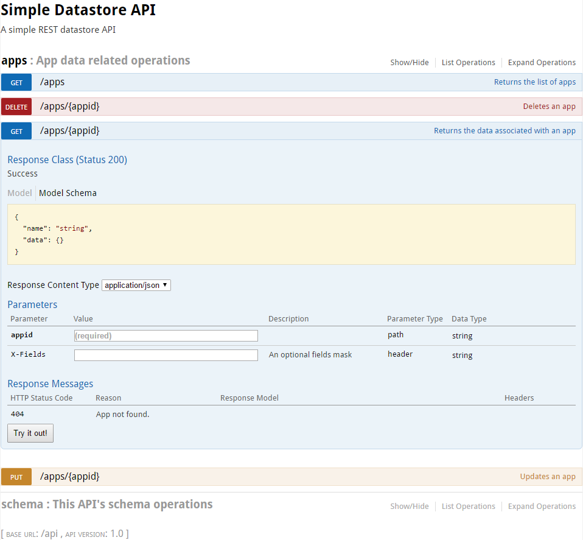

# microstore

A minimal Python REST datastore microservice, which can be in-memory or JSON file backed.

Runs in-memory only by default, or file-backed if a file name is supplied as a command line argument.

Once running, go to the root URL to explore the API using [Swagger UI](http://swagger.io/swagger-ui/).

## Setup

Relies on `flask`, `flask-restplus`, and `tinydb`

```shell
$ pip install flask flask-restplus tinydb
```

Then just clone or download and extract this repository.

## Running

Run with `-h` for full usage options.

```shell
$ python microstore.py
```

Run the tests by similarly running `python test_microstore.py`.

## Usage

You can explore the API using Swagger UI by just opening the root URL that is printed to the terminal when you run the server in your web browser - see an example image of this running below.

In short though, you can `PUT` JSON data to `/apps/<your-app-name-here>` as the `data` key of an object:

```javascript
{
  "data": {
    "any_data": "you_like_here"
  }
}
```

and later retrieve it with a `GET` on the same URL, `DELETE` it, or replace it with another `PUT`.



